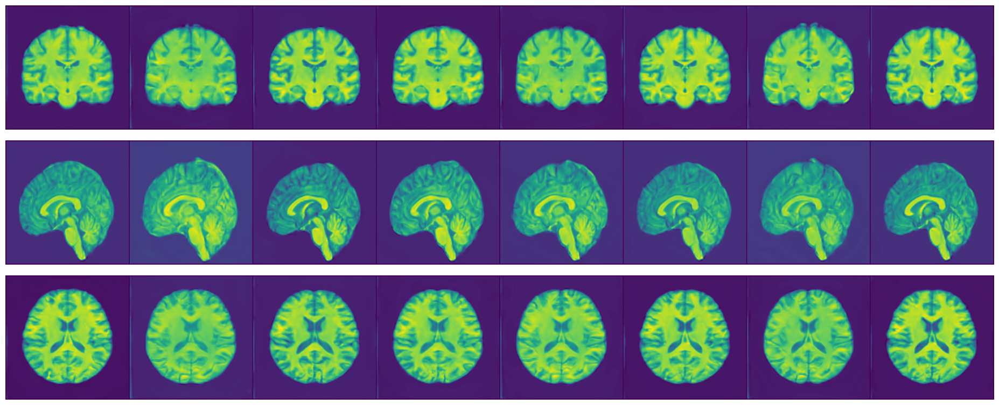

# Data Synthesis using HAGAN

This project demonstrates how to train a model that can generate synthetic brain (T1w) MRI data. The work was presented as a [poster at ICAART 2025](https://www.insticc.org/node/TechnicalProgram/icaart/2025/presentationDetails/130436).

Our code trains a Hierarchical Amortized GAN (HAGAN) model for 3D high resolution medical image synthesis of healthy subjects in MNI space. It is based on [PyTorch Lightning](https://lightning.ai/docs/pytorch/stable/). As part of this repository we share a few different configurations to reproduce our experiments.


*Figure 1: Example of a Synthetic Brain MRI*

Authors:

* [Michela Azzarito](mailto:michela.azzarito@novartis.com>)
* [Jonathan Ziegler](https://scholar.google.com/citations?user=KVhHElwAAAAJ&hl=en>)
* [Ruchen Liu](mailto:rl952@bath.ac.uk)
* [Peter Krusche](http://github.com/pkrusche)

## Usage

In this project, we train a model to generate synthetic T1-weighted (T1w) brain MRI data via the following steps:

1. **Train the model:**

   ```bash
   python src/train/main_train.py data_basedir=<path_to_training_data> runs_basedir=<path_to_outputs>
   ```

2. **Evaluate the model:**

   ```bash
   python src/evaluate/main_evaluate.py data_basedir=<path_to_training_data> runs_basedir=<path_to_outputs> \
       hydra.run.dir=<path_to_hydra_job> experiment_name=conditional-umap-cluster-wgp-hagan
   ```

3. **Generate synthetic data:**

   ```python
   from helpers import evaluate_utils

   this_checkpoint_path = <path_trained_model>
   synthetic_data_dir = <path_to_save_synthetic_data>
   cfg = <hydra_config>
   num_samples = 10  # number of samples you want to generate

   files, low_res_files = evaluate_utils.generate_synthetic_data(
      checkpoint_path=this_checkpoint_path,
      synthetic_data_dir=synthetic_data_dir,
      cfg=cfg,
      num_samples=num_samples
   )
   ```

## Installation and dependencies

The code in this repository has a set of requirements that can be installed using [Conda](https://anaconda.org/anaconda/conda).  The `dev-scripts` folder contains a script to install the dependencies automatically. Note that depending on the hardware setup, slightly different sets of packages (e.g., PyTorch or PyTorch GPU) might be needed.

```bash
bash dev-scripts/create-env.sh
conda activate ./conda-env/  # activate the environment
```

## Obtaining a demonstration dataset

We demonstrate the functionality of the code in this repository using the [IXI MRI dataset](https://brain-development.org/ixi-dataset/) which is publicly available for download.

### Data preprocessing

To start, please download:

1. The [input data](https://brain-development.org/ixi-dataset/):
   - Download the demographic information spreadsheet. This should be one file: `IXI.xls`.
   - The images can be downloaded during preprocessing via TorchIO. If this does not work, you can also download `IXI-T1.tar` manually and place the contained files into a manually prepared raw dataset folder (use the subfolder `T1` to ensure TorchIO recognizes the files).

2. The MNI templates [ICBM 2009c Nonlinear Symmetric](https://nist.mni.mcgill.ca/icbm-152-nonlinear-atlases-2009/):
   - Download the file named `mni_icbm152_nlin_asym_09c_nifti.zip`.

To **preprocess the clinical data**, run the following:

```bash
python src/preprocessing/preprocess_ixi_demographics.py <path-to-IXI.xls> <path-to-preprocessed-IXI.csv>
```

This preprocessing step will perform basic binning and handle duplicated subject IDs by suppressing discordant information between duplicated records.

To **preprocess the images**, some additional packages are needed:

- [HD-BET](https://github.com/MIC-DKFZ/HD-BET)
- [ANTs](https://andysbrainbook.readthedocs.io/en/latest/ANTs/ANTs_Overview.html)

To create a conda environment with these requirements installed, you may use `dev-scripts/create-preprocessing-env.sh`.

Once all dependencies are available, you can run the following:

```bash
python src/preprocessing/preprocess_ixi_mris.py --mni-template-path <mni-template-path> <path-to-output-location>
# use pre-downloaded files
# python src/preprocessing/preprocess_ixi_mris.py --no-download --raw-data-path <path-to-downloaded-images> --mni-template-path <mni-template-path> <path-to-output-location>
```

To keep intermediate files (for debugging/incremental runs), you can specify a persistent folder for them via the `-i` option.

```bash
python src/preprocessing/preprocess_ixi_mris.py -i <location-for-temp-files> --mni-template-path <mni-template-path> <path-to-output-location>
```

Processing all 581 images will take a long time but can be parallelized in batches. For this, the preprocessing script can process batches of images which can be submitted to run in parallel, e.g.

```bash
python src/preprocessing/preprocess_ixi_mris.py -i <location-for-temp-files> --mni-template-path <mni-template-path> <path-to-output-location> \
   --batch-range 0,100
python src/preprocessing/preprocess_ixi_mris.py -i <location-for-temp-files> --mni-template-path <mni-template-path> <path-to-output-location> \
   --batch-range 100,200
# ...
python src/preprocessing/preprocess_ixi_mris.py -i <location-for-temp-files> --mni-template-path <mni-template-path> <path-to-output-location> \
   --batch-range 500,-1
```

## Training Workflows

After obtaining or processing the training data, you can train a model. We implemented the following two models:

a. HAGAN as in [this paper](https://arxiv.org/pdf/2008.01910.pdf).
b. WGP-HAGAN, which is the same model as above but uses the Wasserstein gradient penalty loss function.

To run the training, you need to specify:

- `data_basedir`: path to the training data (or post-processed MRI)
- `runs_basedir`: path to the output (i.e., save checkpoints and training outputs)

```bash
python src/train/main_train.py data_basedir=<path_to_training_data> runs_basedir=<path_to_outputs>

# Change the model using:
python src/train/main_train.py data_basedir=<path_to_training_data> runs_basedir=<path_to_outputs> model.net._target_=model_architecture.ha_gan.HAGAN
```

Both models may be configured further as follows:

- We may use a conditional model, where the model is conditioned on a categorical feature variable.
- We may use an additional encoder/decoder part to study the latent space of the model.

We found that using small training datasets, only the WGP-HAGAN model produced reasonable training results. To evaluate the performance of the WGP-HAGAN model, we trained four WGP-HAGAN models using the following conditions:

1. Unconditional case (the default), defined in `conf/default.yaml`
2. Conditioned on demographical data, defined in `conf/experiment/conditional-demographics-wgp-hagan.yaml`
3. Conditioned on a random categorical variable, defined in `conf/experiment/conditional_rand_cluster.yaml`
4. Conditioned on clusters from UMAP space, defined in `conf/experiment/conditional_cluster.yaml`

You can run each experiment using:

```bash
# First move to the repository folder and activate the conda environment
# Then run the Python code using Hydra config for each condition:

# Conditioned on clusters from UMAP space
python src/train/main_train.py data_basedir=<path_to_training_data> runs_basedir=<path_to_outputs> --multirun +experiment=conditional_cluster

# Conditioned on demographical data
python src/train/main_train.py data_basedir=<path_to_training_data> runs_basedir=<path_to_outputs> --multirun +experiment=conditional-demographics-wgp-hagan

# Conditioned on a random categorical variable
python src/train/main_train.py data_basedir=<path_to_training_data> runs_basedir=<path_to_outputs> --multirun +experiment=conditional_rand_cluster

# Run multiple experiments:
python src/train/main_train.py data_basedir=<path_to_training_data> runs_basedir=<path_to_outputs> --multirun +experiment=conditional_cluster,conditional-demographics-wgp-hagan
```

**Note:** For the last two conditions, based on umap clusters, you need to first train a basic model (i.e. the unconditional model), then run the evaluation, and finally use the script `preprocessing/clustering_original_data.py`, which defines both random and UMAP clustering groups.

We use [Hydra](https://hydra.cc/) to manage models and parameterization, as well as to orchestrate the main parts of our modeling workflow.

### Continue Training and Fine Tuning

When your training stops, there are two main cases/options:

1. **Continue training**: Resume the training from the last saved epoch after an interruption.

   In this case, you need to specify:

   - `train.continue_train=True`
   - `hydra.run.dir`: Path to the Hydra run directory to resume all saved files and settings.
   - `experiment_name`: As defined in the training (if specified during training).

   Terminal command:

   ```bash
   python src/train/main_train.py data_basedir=<path_to_training_data> runs_basedir=<path_to_outputs> hydra.run.dir=<path_to_hydra_job> train.continue_train=True experiment_name=conditional-umap-cluster-wgp-hagan
   ```

   In this case, the training function:

   - Loads `hparams.yaml` as the config file (it includes all changed variables).
   - Finds the last checkpoints in the job directory.
   - Loads the model from the checkpoints.
   - Provides the trainer with checkpoints (the training continues from the last epoch).

2. **Continue training with changes**: Resume the training with some modifications (e.g., train only high resolution, change learning rate, batch size).

   Terminal command:

   ```bash
   python src/train/main_train.py train.pretrained_model_weights=<path_to_checkpoint.ckpt>
   ```

   In this case, the function loads the saved model, and the training starts from epoch 0 with all other inputs defined in the function call, saving the output in the path specified in `hydra.run.dir`.

## Evaluate the trained model

The evaluation includes both visual and quantitative methods:

1. Visual evaluations of:
   - Synthetic images
   - UMAP

2. Quantitative evaluation using:
   - Fréchet Inception Distance (FID)
   - Precision and recall
   - (optional) Mean Square Error (MSE) from the mean

**Prerequisites:**
Ensure you have the following:

- Processed data
- Trained models
- Pretrained embedding model, i.e., [MedicalNet](https://github.com/Tencent/MedicalNet)

To extract embeddings using MedicalNet:

1. We include an adapted version of the resnet code from the [MedicalNet repository](https://github.com/Tencent/MedicalNet) (licensed under the [MIT license](https://github.com/Tencent/MedicalNet/blob/master/LICENSE)) in `src/model_architecture/medicalnet`.

2. Download the [trained model](https://drive.google.com/file/d/13tnSvXY7oDIEloNFiGTsjUIYfS3g3BfG/view). You need resnet_50_23dataset.pth as configured in `conf/evaluate/default_evaluate.yaml`.

The pretrained MedicalNet can be downloaded from [Google Drive](https://drive.google.com/file/d/13tnSvXY7oDIEloNFiGTsjUIYfS3g3BfG/view) or [Tencent Weiyun](https://share.weiyun.com/55sZyIx).

### Evaluation workflow and commands

The main evaluation workflow includes:

1. Generation of synthetic data
2. Computation of MRI embeddings (for real and synthetic data) using pretrained MedicalNet
3. UMAP plots (different plots based on conditions)
4. Computation of quantitative metrics
5. (optional) Measurement of the mean square error to the average map

Many studies have shown that the performance of deep learning models is significantly affected by the volume of training data. The MedicalNet project provides a series of 3D-ResNet pre-trained models.

Example command to run the evaluation:

```bash
python src/evaluate/main_evaluate.py data_basedir=<path_to_training_data> runs_basedir=<path_to_outputs> \
    hydra.run.dir=<path_to_hydra_job> experiment_name=conditional-umap-cluster-wgp-hagan
```

### Fréchet Inception Distance (FID)

Fréchet Inception Distance ([FID](https://arxiv.org/abs/1706.08500)) is a measure of similarity between two datasets of images. It correlates well with human judgment of visual quality and is commonly used to evaluate the quality of samples generated by Generative Adversarial Networks (GANs). FID is calculated by computing the Fréchet distance between two Gaussians fitted to feature representations of the Inception network.

Calculating the FID involves:

1. Generation of synthetic data.
2. Embedding of the real and synthetic data using MedicalNet.
3. Calculation of the FID scores.

**Recommendations:** A minimum sample size of 10,000 is recommended to calculate the FID accurately; otherwise, the true FID of the generator may be underestimated.

**Interpretation:** Lower FID scores indicate better quality.

### Precision and Recall

Precision and recall are measures of the fidelity and diversity of synthetic data. Precision represents the ratio of synthetic data lying within the manifold defined by real data, while recall measures the ratio of real data lying within the manifold of synthetic data. These metrics assess data fidelity and diversity separately, providing a better description of the performance of generative models.

Calculation of precision and recall is performed in the embedding space using MedicalNet, following the [improved precision and recall paradigm](https://arxiv.org/abs/1904.06991).

## References

- Sun et al 2022, [Hierarchical Amortized GAN for 3D High Resolution Medical Image Synthesis](https://ieeexplore.ieee.org/abstract/document/9770375)
- MNI Template used: [ICBM 2009c Nonlinear Symmetric](https://nist.mni.mcgill.ca/icbm-152-nonlinear-atlases-2009/)

- [MedicalNet](https://github.com/Tencent/MedicalNet)
- [MedicalNet trained weights](https://drive.google.com/file/d/13tnSvXY7oDIEloNFiGTsjUIYfS3g3BfG/view)
- FID source code adapted from [public package](https://github.com/mseitzer/pytorch-fid)
- Precision and recall source code adapted from [Improved precision and recall method](https://github.com/kynkaat/improved-precision-and-recall-metric)

## License

See <LICENSE.md>
